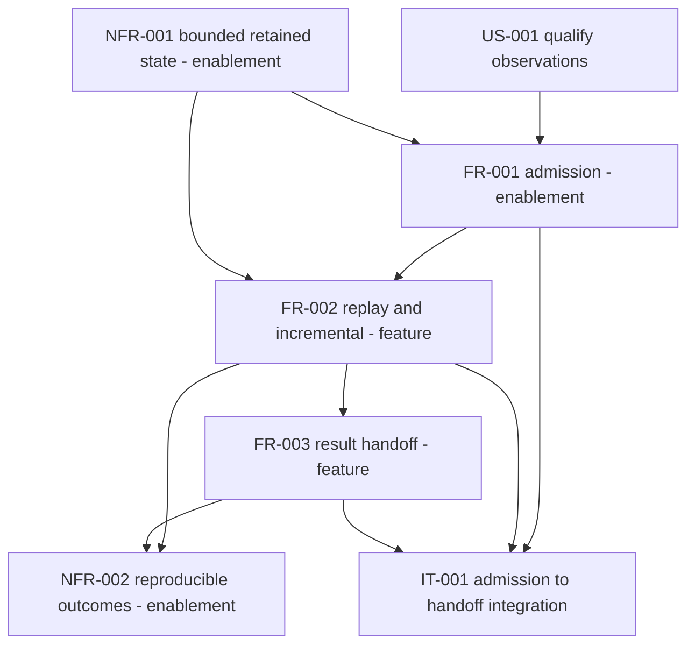

## Summary

This analysis separated enablement from feature work across FR-001, FR-002,
FR-003, NFR-001, NFR-002, IT-001 and the three test cases, and checked the
intended landing order (#5 and #6, then #7, then #8, then #9, then #10) against
the requirement dependency graph and the current code shape at d5dd3f9. The
requirement graph is a clean DAG — FR-001 to FR-002 to FR-003, with NFR-001
constraining the first two and NFR-002 the last two — and there is no cycle
between FR-002's outputs and FR-003's inputs. The task order is sound in its
#5/#6-before-#7 and everything-before-#10 edges, but it has one edge in the
wrong direction (#7 before #8) and one criterion with no task that writes its
test, which is the exit gate of #10.

## Findings

| ID | Severity | Summary | Refs |
| --- | --- | --- | --- |
| FND-001 | high | FR-001-AC-5 is minted and unbacked, assigned to issue #6, but #6's change list writes no test for it. #6 changes `src/handoff.rs` (RetainedEvents axis) and `src/replay.rs` `unavailable()`, and binds NFR-001-AC-3 and NFR-001-AC-4; FR-001-AC-5 is an admission-side criterion (caller-opaque member object identity, unrecomputed membership/closure digests) whose behavior already exists at `src/lib.rs:317-331, 402-426` and whose tag appears nowhere under `tests/`. No other issue in #5-#10 names it. As tasked, #10's exit gate (`quire coverage --json` with `backed == total` and `unbacked_rows: []`) cannot pass, so the ordering is not wrong but it is incomplete at its terminal node. | FR-001-AC-5; spec/tests.md TC-001 row; issues #6, #10; src/lib.rs:317-331, 402-426 |
| FND-002 | medium | The #7-before-#8 edge is backwards. #7's durable fix is `ResultAxis::ALL` plus a table-length assertion so a future axis added without an omission test fails the build. #8 then adds `ReplayResult.superseding_records` — a new independently readable result fact with no capability flag, which is exactly the D2 class #6 and #7 exist to close — and a length assertion over `ResultAxis` cannot see a new `ReplayResult` field that was never given an axis. Landing #7 first certifies a seventeen-axis set and then grows the readable-fact set behind the gate. Either land #8 before #7, or record in #8 that `superseding_records` is read through the existing LateSupersession axis and adds no axis, which FR-003's "SHALL NOT let one capability stand for two result axes" makes an explicit, reviewable claim rather than an omission. | FR-003 Behavior (seventeen axes, one capability per axis); issues #7, #8; src/handoff.rs:45-59, 113-128, 175-213 |
| FND-003 | medium | FR-001 Dependencies names `agent-ix/quire-spec-language` as the owner that "exports the `native-linked-package/1` selection with its canonical membership and closure digests (its FR-015 and FR-027)", but neither cited requirement carries that obligation: FR-015 never mentions membership or closure, and FR-027's digest is the SHA-256 of the exported package bytes, not a membership or closure digest. The nearest upstream holder of population membership and target closure contracts is that repository's FR-040. The upstream edge is non-blocking (FR-001 retains the digests as given and FR-001-AC-5 requires admission to proceed without recomputation) but it points at requirements that do not state the export. | FR-001 Dependencies; FR-001-AC-5; agent-ix/quire-spec-language FR-015, FR-027, FR-040 |
| FND-004 | low | No cycle exists between FR-002 and FR-003, but FR-003 Inputs overstates the edge. It names "its immutable selection dependencies, as returned by FR-002", while FR-002 Outputs lists only a disposition, a supersession/invalidation link, an ambiguous-order outcome and a retained-event count. In code the dependencies arrive as `AssessmentHandoff.dependencies` at the handoff call site, independent of `ReplayResult`, so the real edge is an unstated FR-001 to FR-003 pass-through. It adds no ordering constraint (it is transitive through FR-002) but NFR-002-AC-2's evidence sits on a path the spec does not record. | FR-002 Outputs; FR-003 Inputs; NFR-002-AC-2; src/handoff.rs:96-110 |
| FND-005 | low | #9 does not depend on #5, #6 or #8 and is over-constrained by being placed after them. Its asserted Completeness axis and the `IncompleteHistory` disposition both predate the bundle, and its consumer is built by flipping one flag on `ConsumerCapabilities::all()`, which #5 and #6 update themselves, so `lost_axes == [Completeness]` and `mapping == Unrepresented` hold in any order. Conversely, #9's D7 half (the batch/incremental missed-deadline agreement case) is the only regression guard over #8's symmetric two-path supersession edit; as ordered, #8 lands without it. Run #9 in parallel with #5/#6, or land its D7 case before #8. | IT-001 SC-02/SC-04; FR-002-AC-1; issues #8, #9; src/handoff.rs:130-149, 213-226; tests/replay.rs:66-79; tests/pipeline.rs:176-186 |
| FND-006 | low | #8 does not alter the part of `ReplayResult` that #5's and #6's axes read, so the #5/#6-before-#8 order is not wrong: the four scope facts are `AssessmentHandoff` fields supplied at handoff, not replay outputs, and #8 leaves `retained_events` alone. The only overlap is textual — #6 and #8 both rewrite `unavailable()` — so whichever lands second must preserve the other's invariant (`retained_events == 0` from #6, late records already cleared from #8). | issues #6, #8; src/replay.rs:96-120, 320-333 |
| FND-007 | low | #8's new `Disposition::AmbiguousOrder` reaches the handoff mapping classification through a non-exhaustive `matches!` over `Satisfied` or `Violated`, so the new variant falls to `Unrepresented` with no compile error anywhere in `src/handoff.rs`. That default is correct by intent, but it is unverified: #8 should assert the mapping state for an ambiguous-order result rather than inherit it silently. | FR-003-AC-1; FR-002-AC-4; issue #8; src/handoff.rs:213-226; src/replay.rs:202-207 |

## Classification

| Requirement | Class | Rationale |
|-------------|-------|-----------|
| US-001 | Feature | Consumer need that all three stages serve. No implementation of its own. |
| FR-001 | Enablement | Mints the identity, digest, member, scope and limit substrate and the qualified-observation envelope every later requirement reads. Its own output is an envelope, not a consumer-visible assessment. |
| FR-002 | Feature | Produces the caller-visible typed disposition, late-supersession link, ambiguous-order outcome and retained-event count. |
| FR-003 | Feature | Produces the consumer handoff, the only externally delivered artifact of the library. |
| NFR-001 | Enablement | Bound enforcement inside the FR-001 and FR-002 retention paths. No behavior of its own and no consumer-visible output beyond the counters FR-003 then carries. |
| NFR-002 | Enablement | Determinism and dependency-retention constraint over FR-002 and FR-003 outputs. Verified, not implemented as a separate surface. |

| Evidence artifact | Class | Covers |
|-------------------|-------|--------|
| TC-001 | Evidence | FR-001-AC-1..5, NFR-001-AC-1, NFR-001-AC-4 |
| TC-002 | Evidence | FR-002-AC-1..4, NFR-001-AC-2, NFR-001-AC-3, NFR-001-AC-5, NFR-002-AC-1 |
| TC-003 | Evidence | FR-003-AC-1..3, NFR-002-AC-2 |
| IT-001 | Evidence | Joins FR-001, FR-002 and FR-003 through a typed in-process sink. Asserts no new obligation, so it is ordered by the requirements it exercises, not the reverse. |

## Dependency Graph

Every edge is an explicit prerequisite taken from a Dependencies, Inputs or
relationships declaration. The unstated FR-001 to FR-003 dependency-retention
edge recorded in FND-004 is transitive through FR-002 and adds no constraint.

## Topological Order (suggested implementation sequence)

1. NFR-001 bounds and FR-001 admission (enablement, FR-001 first where they meet).
2. FR-002 replay and incremental assessment.
3. FR-003 result handoff.
4. NFR-002 reproduction checks and IT-001 integration evidence (parallelizable once FR-003 exists).

## Cycles

None detected. FR-002 Outputs feeds FR-003 Inputs and nothing in FR-002 Inputs,
Behavior or Error Conditions reads an FR-003 output. The retained-event count
named in FR-003 Inputs is produced by FR-002 (`ReplayResult.retained_events`)
and consumed once, so naming it there creates a single forward edge, not a
cycle. The late-supersession pair is likewise one-directional: FR-002 emits the
link, FR-003 preserves the prior result bytes it points at.

## Task-level Order

| Issue | Class | Prerequisites that hold | Verdict |
|---|---|---|---|
| #5 split scope facts into four axes | Enablement | Spec cycle #3 (closed) | Sound. Independent of #6. |
| #6 retained-event axis and honest retention | Enablement | Spec cycle #3 (closed) | Sound. Independent of #5. |
| #7 exhaustive self-enforcing omission sweep | Enablement (evidence gate) | #5 and #6 fix the axis set | Needs #8 as well — see FND-002. |
| #8 contradiction-keyed supersession, typed ambiguous order | Feature | Spec cycle #3 (closed) | Move before #7. Does not disturb #5/#6 axes (FND-006). |
| #9 real IT-001 and missed-deadline agreement | Evidence | None in this bundle | Order-independent, parallelizable (FND-005). |
| #10 coverage record and authoritative audit | Gate | All of the above plus FR-001-AC-5 evidence | Sound as the terminal node, but unreachable until FND-001 is tasked. |

Revised order: #5 and #6 in either order, then #8, then #7, with #9 parallel to
any of them, then #10 last. FR-001-AC-5 needs an owner before #10 can pass.

## External Dependencies

| External | Direction | Blocks this bundle | Evidence |
|---|---|---|---|
| `agent-ix/quire-spec-language` | Upstream | No | `Cargo.toml` declares zero dependencies, so the package compiler is not a crate dependency; FR-001 Dependencies calls the selected artifact and Producer interface 1.2.0 caller-provided, and FR-001 Behavior plus FR-001-AC-5 require admission to retain the membership and closure digests without recomputation. Nothing in #5-#10 touches canonicalization. The cited FR-015/FR-027 attribution is nonetheless wrong (FND-003). |
| `agent-ix/quire-protocol` (#12 under EPIC #14) | Downstream | No | #12 consumes observation and temporal facts and is blocked inside its own repository by Task-006 / its #8, not by this library. Neither its `Cargo.toml` nor its spec references `quire-observation`, so there is no reverse edge. It is the beneficiary of #5, #6 and #8 — it would invalidate a still-valid result under the current unconditional supersession link — which raises the value of #8 but creates no prerequisite for it. |

## Recommendations

1. Task FR-001-AC-5 explicitly, in #6 or a sibling issue, before #10 runs.
2. Swap #7 and #8, or state in #8 that `superseding_records` is read through the
   LateSupersession axis and adds no eighteenth axis.
3. Release #9 to run in parallel, and land its missed-deadline agreement case
   before #8 edits both assessment paths.
4. Correct FR-001 Dependencies to cite the upstream requirement that actually
   exports the membership and closure digests, or record that no upstream
   requirement states it yet.
