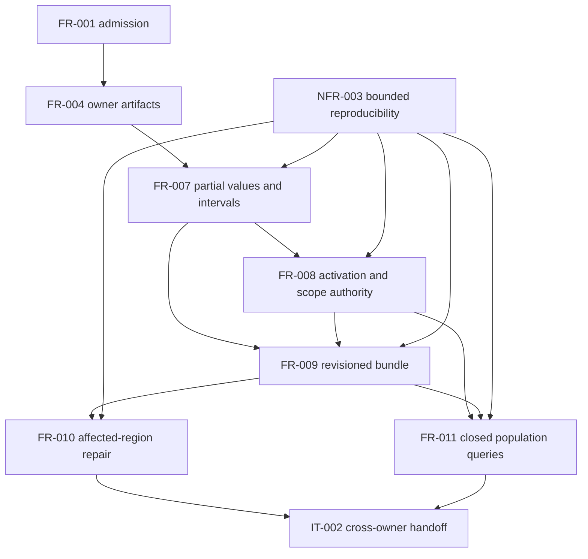

# SR-041: Dependency review of the C00 observation specification

## Summary

The requirement graph is acyclic and separates authority enablement from repair
and query features. FR-010 and FR-011 can proceed independently only after their
shared FR-008/FR-009 authority prerequisites are accepted.

## Findings

| ID | Severity | Summary | Refs |
|---|---|---|---|
| FND-047 | low | No unresolved dependency defect; explicit edges yield one acyclic C00 implementation order. | FR-007..FR-011; NFR-003 |

## Classification

| Requirement | Class | Rationale |
|---|---|---|
| FR-001 | Enablement | Supplies qualified admitted records and identity domains. |
| FR-004 | Enablement | Supplies canonical owner documents and strict readers. |
| FR-007 | Enablement | Defines partial values and interval relations used downstream. |
| FR-008 | Enablement | Defines activation and independent scope-authority axes. |
| FR-009 | Enablement | Defines the immutable revisioned I07 bundle and lineage view. |
| FR-010 | Feature | Exposes affected-region repair and settled incremental coordination. |
| FR-011 | Feature | Evaluates exact closed-population filter/count/sum queries. |
| NFR-003 | Enablement | Constrains every C00 path to reproducible bounded work. |

## Dependency Graph

## Topological Order

1. Retain accepted FR-001/FR-004 owner foundations and apply NFR-003 constraints.
2. Implement FR-007, then FR-008.
3. Implement FR-009 after FR-007 and FR-008.
4. Implement FR-010 and FR-011 independently after FR-009.
5. Run IT-002 after both feature branches and compatible consumer revisions.

## Cycles

None detected. Runtime dependency graphs may contain cycles as data, but their
bounded traversal is FR-010 behavior and does not create a requirement cycle.

## Verdict

PASS. The DAG is ready for forward task planning.
