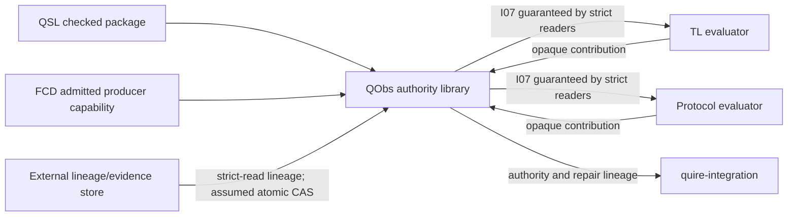

# SR-044: Scope and boundary review of C00 observation authority

## Summary

QObs owns observation admission, authority facts, revision lineage, repair-impact
planning and closed observation-population queries. Temporal/protocol evaluation,
composition, persistence and external effects remain outside the system boundary.

## Findings

| ID | Severity | Summary | Refs |
|---|---|---|---|
| FND-052 | medium | Resolved: FR-009's branch language implied global publication serialization; it now states that QObs validates a supplied lineage view while an external store owns atomic compare-and-swap. | FR-009 |

## System Context

## External Dependencies

| Dependency | Type | Assumed or Guaranteed | Contract |
|---|---|---|---|
| QSL package | canonical Rust/wire input | Guaranteed | strict reader plus exact revision/digest mutation tests |
| FCD Producer 1.2 | constructor-private Rust capability | Guaranteed | retained admitted bundle and TC-001/TC-005 |
| TL and Protocol | typed evaluator consumers/contributions | Guaranteed | pinned contract tests in IT-002; their semantics remain opaque |
| Lineage persistence | atomic compare-and-swap store | Assumed | caller supplies strict-read lineage; store atomicity is not claimed by QObs |
| quire-integration | downstream composition | Guaranteed at handoff | I07/repair integration in IT-002 and later C14 qualification |

## Responsibility Allocation

| Requirement | Owning Component | Class |
|---|---|---|
| FR-001 | admission subsystem | core |
| FR-007 | partial-value/clock authority subsystem | core |
| FR-008 | activation and scope-authority subsystem | core |
| FR-009 | bundle and lineage subsystem | core |
| FR-010 | repair-impact coordinator | core |
| FR-011 | closed-population query subsystem | core |
| NFR-003 | all C00 public and internal paths | cross-cutting |

## Out-of-Scope Confirmation

No requirement parses source, interprets a temporal/protocol formula, decides a
business effect, persists a global head, discovers an ambient population, or
owns the composed application runtime.

## Verdict

PASS. Every reviewed requirement has one owner and no external authority is
silently absorbed.
